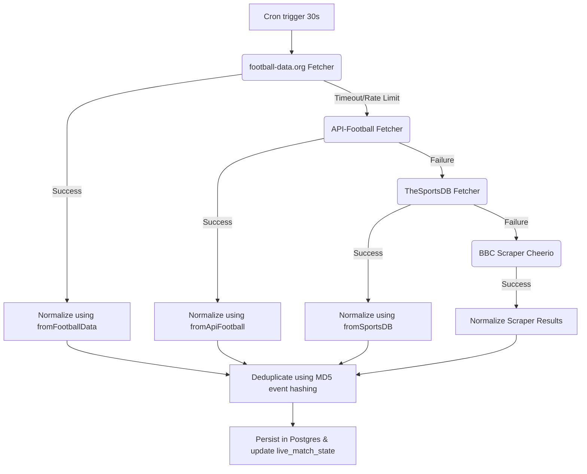

# GoalIQ Live System & API Technical Report

The GoalIQ Live backend architecture, security middleware, ingestion cascading runner, caching strategy, and database schema mappings are fully implemented. Below is the complete catalog of all directories, endpoints, schemas, and configurations.

---

## 1. Directory Structure

```text
goaliq-live/
├── backend/
│   ├── api/
│   │   ├── middleware/
│   │   │   └── auth.js         # Supabase JWT authorization validator
│   │   ├── insights.js         # AI Commentary routes
│   │   ├── leagues.js          # League metadata routes
│   │   ├── matches.js          # Live and historical match queries
│   │   ├── predictions.js      # Predict submission & point scoring
│   │   ├── reactions.js        # Emoji engagement routes
│   │   ├── teams.js            # Team metadata routes
│   │   └── users.js            # Leaderboards & profile register
│   ├── db/
│   │   ├── seed.js             # Mock data seeder script
│   │   └── supabase.js         # Supabase client wrapper & transactions
│   ├── ingestion/
│   │   ├── apiFootballFetcher.js  # API-Football (v3) client
│   │   ├── footballDataFetcher.js # football-data.org (v4) client (Primary)
│   │   ├── sportsDBFetcher.js     # TheSportsDB client
│   │   ├── ingestionService.js    # Data normalizer & diff coordinator
│   │   └── runner.js              # Cron daemon runner
│   ├── normalizer/
│   │   └── index.js            # Normalization adapters per data source
│   ├── notifications/
│   │   └── fcmService.js       # Firebase Cloud Messaging service
│   ├── tests/
│   │   ├── footballData.test.js# Fetcher cache integration tests
│   │   ├── normalizer.test.js  # Raw JSON mapper unit tests
│   │   └── predictions.test.js # Points calculator engine tests
│   ├── utils/
│   │   ├── cache.js            # Hybrid Redis/Node Cache layer
│   │   ├── logger.js           # Winston system logger
│   │   └── retry.js            # Exponential backoff handler
│   ├── Dockerfile              # Multi-stage production container
│   ├── docker-compose.yml      # Service coordinator (API, Ingestion, Redis)
│   └── server.js               # Express application initializer
└── dashboard/
    ├── app.js                  # Console controller & local simulator
    ├── index.html              # Emerald dark-mode control panel
    └── style.css               # Glassmorphic responsive styling
```

---

## 2. Ingestion & Normalization Flow

GoalIQ Live prioritizes data fetches cascading from the lowest cost to the highest reliability:



### Event Type Schemas
Normalized timeline event categories map to one of:
* `goal` / `own_goal` / `penalty`
* `yellow_card` / `red_card`
* `substitution`
* `var`

---

## 3. Unified Caching Strategy (`utils/cache.js`)
All incoming and outgoing requests utilize a hybrid cache-aside client. If a local Redis service is unreachable (e.g. during free-tier container runs), it automatically falls back to in-process memory `node-cache` intervals.

| Cache Key Namespace | Target / Purpose | TTL (Seconds) |
| :--- | :--- | :--- |
| `football_data:matches:*` | football-data.org matches query cache | `30` |
| `football_data:match:<id>` | Match detail (FT/Finished status) | `3600` (1 Hour) |
| `football_data:match:<id>` | Match detail (NS/LIVE status) | `10` |
| `football_data:standings:*` | Competition leaderboard tables | `3600` (1 Hour) |
| `football_data:team:<id>` | Team profile emblems | `86400` (24 Hours) |
| `api:matches:live` | Dashboard live scores endpoint response | `10` |
| `api:match:<id>` | Specific match query API response | `15` |
| `leaderboard:<limit>` | Global user score list API response | `60` |

---

## 4. API Endpoint Specifications

All endpoints are hosted at: `http://localhost:3001/api/v1`

### 4.1 System Health
* **GET `/health`**
  * **Description**: Verifies API availability. Used by dashboard to toggle Live/Simulation environments.
  * **Response (`200 OK`)**:
    ```json
    {
      "status": "healthy",
      "timestamp": "2026-05-20T07:34:43.206Z",
      "env": "development"
    }
    ```

### 4.2 Matches API
* **GET `/matches/live`**
  * **Description**: Returns all matches currently active.
  * **Response (`200 OK`)**:
    ```json
    {
      "data": [
        {
          "id": "mun-liv-101",
          "home_team": "Manchester United",
          "away_team": "Liverpool",
          "home_score": 2,
          "away_score": 1,
          "status": "LIVE",
          "minute": 72,
          "league": "Premier League",
          "start_time": "2026-05-20T00:00:00Z",
          "venue": "Old Trafford",
          "events": [
            { "type": "goal", "team_side": "home", "player": "Marcus Rashford", "minute": 14 }
          ]
        }
      ],
      "count": 1
    }
    ```

* **GET `/matches?league_id=&status=&date=&page=1&limit=20`**
  * **Description**: Pagination queries for fixtures.
  * **Response (`200 OK`)**:
    ```json
    {
      "data": [],
      "count": 0,
      "page": 1,
      "limit": 20
    }
    ```

* **GET `/matches/:id`**
  * **Description**: Retrieves single match with full events timeline.

---

### 4.3 Secure User Prediction Submission
* **POST `/predictions`**
  * **Access Control**: **Requires Authorization Bearer JWT Token** (Supabase Auth).
  * **Request Headers**:
    ```text
    Authorization: Bearer <jwt_token>
    Content-Type: application/json
    ```
  * **Request Body**:
    ```json
    {
      "match_id": "mun-liv-101",
      "predicted_home": 3,
      "predicted_away": 1
    }
    ```
  * **Points Calculation Rules**:
    * **Correct Winner**: $+5$ points
    * **Exact Score**: $+10$ points
    * **Goal Difference**: $+3$ points
    * **Incorrect Result**: $0$ points
  * **Response (`201 Created`)**:
    ```json
    {
      "status": "success",
      "prediction_id": "pred-402910"
    }
    ```

---

### 4.4 Secure Emoji Reactions
* **POST `/reactions`**
  * **Access Control**: **Requires Authorization Bearer JWT Token** (Supabase Auth).
  * **Request Headers**:
    ```text
    Authorization: Bearer <jwt_token>
    Content-Type: application/json
    ```
  * **Request Body**:
    ```json
    {
      "match_id": "mun-liv-101",
      "emoji": "🔥" // Supported emojis: 🔥, 👏, 😮
    }
    ```
  * **Response (`200 OK`)**:
    ```json
    {
      "status": "success"
    }
    ```

---

### 4.5 Users & Leaderboard API
* **GET `/users/leaderboard?limit=50`**
  * **Description**: Global point rankings for Gamification streaks.
  * **Response (`200 OK`)**:
    ```json
    {
      "data": [
        {
          "id": "usr-1",
          "username": "soccer_guru",
          "display_name": "Soccer Guru",
          "total_points": 120,
          "total_predictions": 15,
          "accuracy_pct": 66.67
        }
      ]
    }
    ```

* **GET `/users/:id`**
  * **Description**: Returns user avatar, stats, favorite leagues/teams.

* **POST `/users`**
  * **Description**: Creates or edits profile metadata.

---

### 4.6 AI Live Commentary Insights
* **GET `/insights/:matchId`**
  * **Description**: Query real-time contextual match comments powered by OpenAI.
  * **Response (`200 OK`)**:
    ```json
    {
      "data": [
        {
          "type": "live",
          "content": "Tactical shift detected. Barcelona modified transition structures leading to possession density increase.",
          "created_at": "2026-05-20T08:00:00Z"
        }
      ]
    }
    ```

---

## 5. PostgreSQL Database Schema

```sql
-- Leagues Metadata Table
CREATE TABLE leagues (
    id UUID PRIMARY KEY DEFAULT gen_random_uuid(),
    external_id VARCHAR(50) UNIQUE NOT NULL,
    name VARCHAR(100) NOT NULL,
    country VARCHAR(100),
    logo_url TEXT,
    season VARCHAR(20),
    is_active BOOLEAN DEFAULT true,
    created_at TIMESTAMP WITH TIME ZONE DEFAULT now()
);

-- Teams Table
CREATE TABLE teams (
    id UUID PRIMARY KEY DEFAULT gen_random_uuid(),
    external_id VARCHAR(50) UNIQUE NOT NULL,
    name VARCHAR(100) NOT NULL,
    short_name VARCHAR(10),
    logo_url TEXT,
    league_id UUID REFERENCES leagues(id) ON DELETE SET NULL,
    created_at TIMESTAMP WITH TIME ZONE DEFAULT now()
);

-- Matches Table
CREATE TABLE matches (
    id UUID PRIMARY KEY DEFAULT gen_random_uuid(),
    external_id VARCHAR(50) UNIQUE NOT NULL,
    home_team_id UUID REFERENCES teams(id) ON DELETE CASCADE,
    away_team_id UUID REFERENCES teams(id) ON DELETE CASCADE,
    home_team VARCHAR(100) NOT NULL,
    away_team VARCHAR(100) NOT NULL,
    home_score INT DEFAULT 0,
    away_score INT DEFAULT 0,
    status VARCHAR(20) DEFAULT 'NS', -- NS, LIVE, HT, FT
    minute INT DEFAULT 0,
    league_id UUID REFERENCES leagues(id) ON DELETE SET NULL,
    league VARCHAR(100),
    start_time TIMESTAMP WITH TIME ZONE,
    venue VARCHAR(100),
    source VARCHAR(50) DEFAULT 'api',
    created_at TIMESTAMP WITH TIME ZONE DEFAULT now()
);

-- Match Events Table
CREATE TABLE events (
    id UUID PRIMARY KEY DEFAULT gen_random_uuid(),
    match_id UUID REFERENCES matches(id) ON DELETE CASCADE,
    external_id VARCHAR(100),
    type VARCHAR(50) NOT NULL, -- goal, yellow_card, red_card, substitution, var
    team_side VARCHAR(10) CHECK (team_side IN ('home', 'away')),
    player VARCHAR(100),
    minute INT NOT NULL,
    created_at TIMESTAMP WITH TIME ZONE DEFAULT now(),
    UNIQUE (match_id, external_id)
);

-- Live Match State Cache (Supabase Realtime Channel Sync Target)
CREATE TABLE live_match_state (
    match_id UUID PRIMARY KEY REFERENCES matches(id) ON DELETE CASCADE,
    state JSONB NOT NULL,
    event_hash VARCHAR(64) NOT NULL,
    updated_at TIMESTAMP WITH TIME ZONE DEFAULT now()
);

-- App User Profiles
CREATE TABLE users (
    id UUID PRIMARY KEY DEFAULT gen_random_uuid(),
    auth_id UUID UNIQUE, -- Link to supabase auth.users
    username VARCHAR(50) UNIQUE NOT NULL,
    display_name VARCHAR(100),
    avatar_url TEXT,
    fcm_token TEXT,
    favorite_teams JSONB DEFAULT '[]'::jsonb,
    favorite_leagues JSONB DEFAULT '[]'::jsonb,
    created_at TIMESTAMP WITH TIME ZONE DEFAULT now()
);
```
